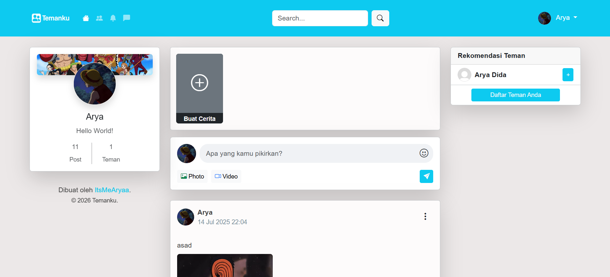
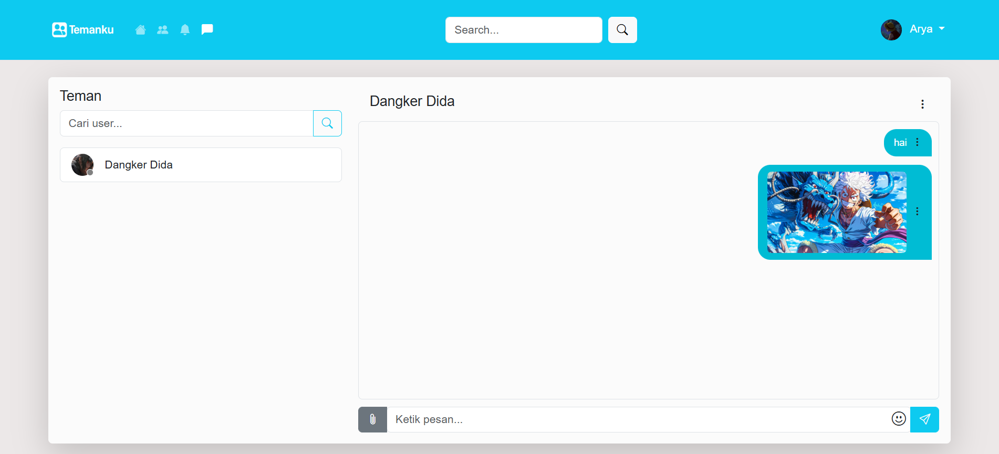

# Temanku - PHP Native Social Media

🇮🇩 Social media website built using PHP Native and MySQL.  
🇺🇸 A simple social media web application built with Native PHP and MySQL.

---

## Features

- User Authentication
- Friend Request System
- Posts, Likes, and Comments
- Nested Comment Replies
- Messenger Chat
- Notifications
- Stories Feature
- Media Upload (Image, Video, Audio)
- Online/Offline Status

---

## Technologies

- PHP Native
- MySQL 8
- Bootstrap 5
- JavaScript
- AJAX

---

## Requirements

- PHP 8+
- MySQL 8+
- Apache Server
- XAMPP or Laragon

---

## Installation

1. Clone this repository

```bash
git clone https://github.com/your-username/temanku.git
```

2. Import the database

Import `db_socialmedia.sql` into MySQL using phpMyAdmin or another database tool.

3. Move the project folder

### XAMPP

```txt
C:\xampp\htdocs\
```

### Laragon

```txt
C:\laragon\www\
```

4. Start Apache and MySQL

5. Open the project in your browser

### XAMPP

```txt
http://localhost/temanku
```

### Laragon

```txt
http://temanku.test
```

---

## Demo Admin Account

Email: admin@example.com  
Password: admin26

---

## Notes

This project was created for learning and portfolio purposes.

---

## Screenshots

### Home Page



### Chat Feature


